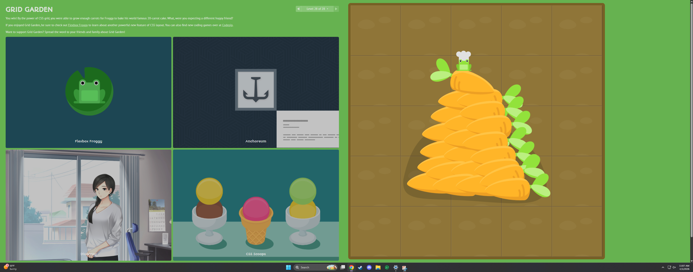
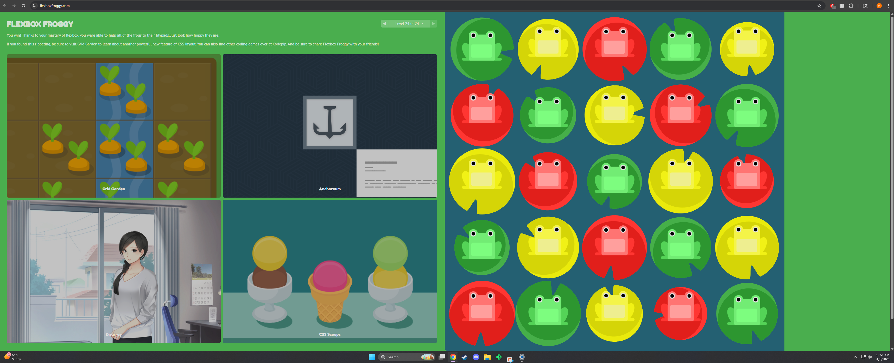

I think this week was kind of all over the place. I enjoyed creating the site, but I'll be honest in saying that I've been having a bit of creative burnout nearing the end of the semester. I find myself kind of rushing through a lot of my projects because I feel like I can't be mentally bothered with any of this, and I want to just focus on my own personal projects and what not... but no big deal, we only have about a month left! As far as flexbox goes, it's pretty awesome and I appreciate how you are able to just continuously add more and more and more into them to make them look a lot nicer. It can be kind of difficult to work without some sort of baseline, so I find it easier to add really simple stuff and then make them prettier the further I go, which I'm sure it common practice.